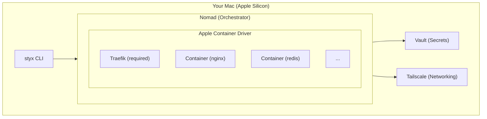
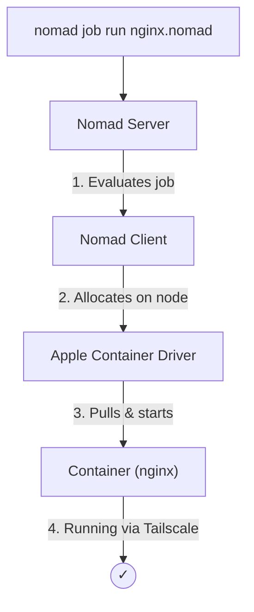
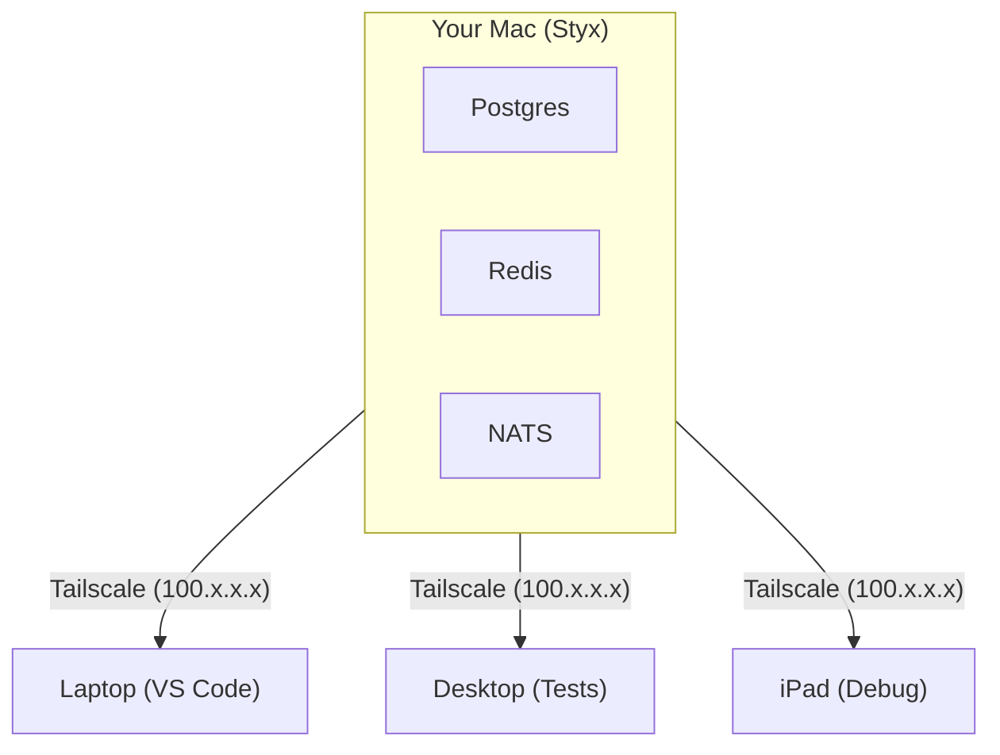
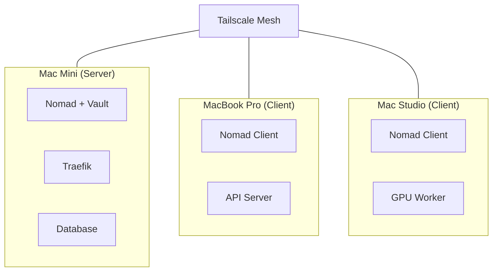
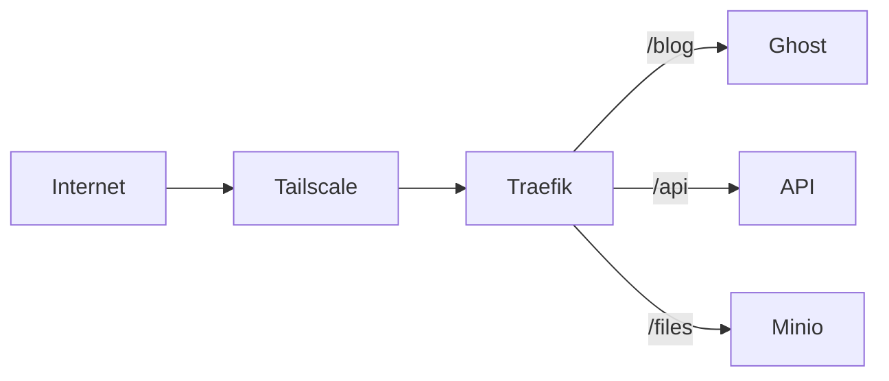

# Styx

[](https://github.com/kessler-frost/styx/releases)
[](LICENSE)
[](https://github.com/kessler-frost/styx)

Your personal cloud platform built for macOS. Deploy containers, manage secrets, and scale across multiple machines—no Docker required.

## Requirements

- macOS 26+ (Tahoe) with Apple Silicon
- [Homebrew](https://brew.sh), [Apple Container CLI](https://github.com/apple/container), [Tailscale](https://tailscale.com/download)

## Installation

```bash
curl -fsSL https://raw.githubusercontent.com/kessler-frost/styx/main/install.sh | sh
```

Or from source: `git clone https://github.com/kessler-frost/styx && cd styx && make build-all`

## Quick Start

```bash
# Start server
styx init

# Join additional nodes (optional)
styx init --join <server-tailscale-ip>

# Deploy a workload
nomad job run example/nginx.nomad

# Start platform services (optional)
styx services start --all
```

## Architecture



**Core Stack:**
- **Nomad** - Container orchestration and scheduling
- **Apple Containers** - Native macOS lightweight VMs
- **Vault** - Secrets management with workload identity
- **Tailscale** - Encrypted mesh networking
- **Traefik** - Ingress with automatic service discovery

**Platform Services:**
- **Traefik** (required) - Ingress controller, deployed by `styx init`
- **Optional** (via `styx services start --all`): NATS, Dragonfly, Prometheus, Loki, Grafana, Promtail, Postgres, RustFS

## How It Works



## Example Use Cases

### Local Dev Environment

Run dev dependencies, accessible from any device on your Tailscale network:



### Multi-Node Cluster

Distribute workloads across multiple Macs:



### Self-Hosted Apps

Host services with automatic routing via Traefik:



## Example Jobs

See `example/` for sample Nomad jobs: `alpine.nomad`, `nginx.nomad`, `nginx-vault.nomad`

## Uninstall

```bash
styx uninstall
```

## License

Apache 2.0 - See [LICENSE](LICENSE)
