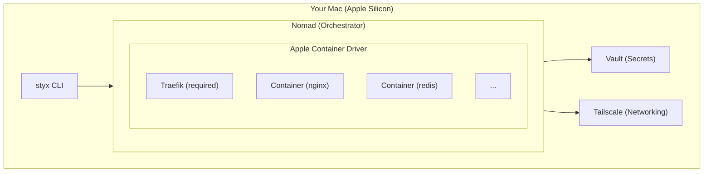
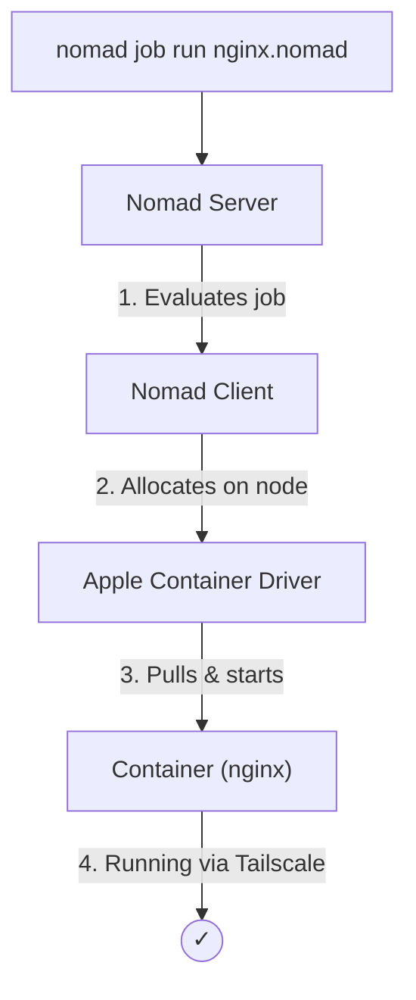
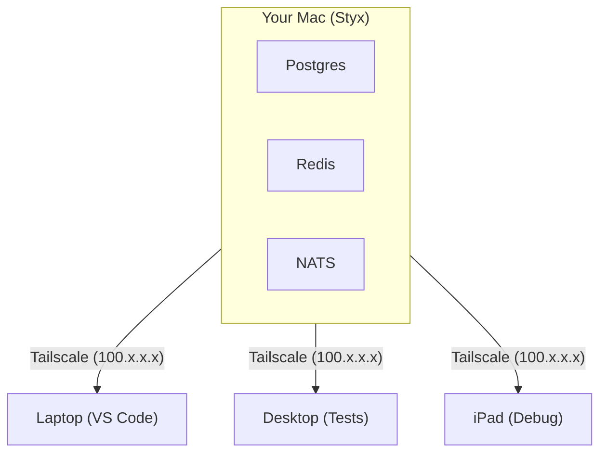
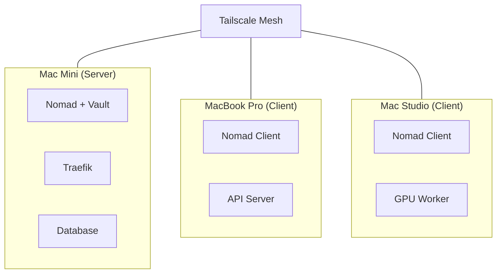
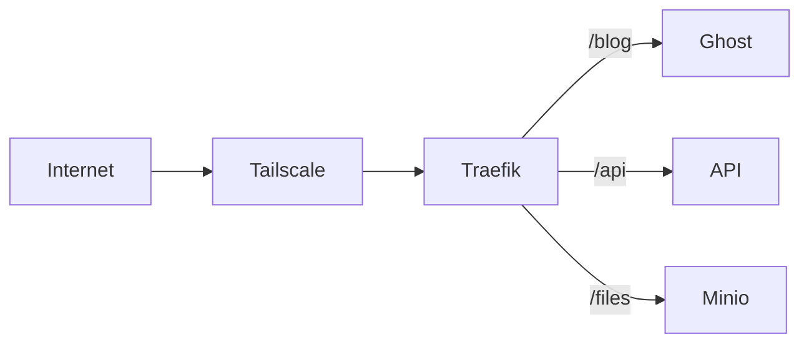

# Styx

[](https://github.com/kessler-frost/styx/releases)
[](LICENSE)
[](https://github.com/kessler-frost/styx)

Your personal cloud platform built for macOS. Deploy containers, manage secrets, and scale across multiple machines—no Docker required.

## What is Styx?

Styx is the glue layer that connects Nomad, Vault, Apple Containers, and Tailscale into a personal cloud platform. It handles the tedious setup—generating configs, managing launchd services, initializing Vault, wiring up networking—so you don't have to.

**The underlying tools work exactly as documented.** You use `nomad` to deploy jobs, `vault` to manage secrets, and standard Nomad job specs to define workloads. Styx just removes the 20 manual steps needed to get them working together on macOS.

**What Styx provides:**
- **One-command cluster bootstrap** - `styx init` sets up Nomad + Vault with proper configs
- **Apple Container driver** - A Nomad task driver for Apple's native container runtime
- **Traefik ingress** - Auto-deployed gateway for accessing services (HTTP at `:4200`, plus TCP routing for NATS/Redis)
- **Multi-machine clustering** - Auto-discovers nodes via Tailscale, handles server/client setup
- **Platform services** - Pre-configured jobs for databases, caches, and observability

No Docker, no Kubernetes. Just lightweight Apple containers orchestrated by Nomad.

## Requirements

- macOS 26+ (Tahoe) with Apple Silicon
- [Homebrew](https://brew.sh), [Apple Container CLI](https://github.com/apple/container), [Tailscale](https://tailscale.com/download)

## Installation

```bash
curl -fsSL https://raw.githubusercontent.com/kessler-frost/styx/main/install.sh | sh
```

Or from source: `git clone https://github.com/kessler-frost/styx && cd styx && make build-all`

## Quick Start

```bash
# Start server
styx init

# Join additional nodes (optional)
styx init --join <server-tailscale-ip>

# Deploy a workload
nomad job run example/nginx.nomad

# Start platform services (optional)
styx services start --all
```

## Architecture


```mermaid
flowchart TB
    subgraph mac["Your Mac (Apple Silicon)"]
        cli["styx CLI"]
        subgraph nomad["Nomad (Orchestrator)"]
            subgraph driver["Apple Container Driver"]
                traefik["Traefik (required)"]
                c1["Container (nginx)"]
                c2["Container (redis)"]
                c3["..."]
            end
        end
        vault["Vault (Secrets)"]
        ts["Tailscale (Networking)"]
    end

    cli --> nomad
    nomad --> vault
    nomad --> ts
```

**Core Stack:**
- **Nomad** - Container orchestration and scheduling
- **Apple Containers** - Native macOS lightweight VMs
- **Vault** - Secrets management with workload identity
- **Tailscale** - Encrypted mesh networking
- **Traefik** - Ingress with automatic service discovery

**Platform Services:**
- **Traefik** (required) - Ingress controller, deployed by `styx init`
- **Optional** (via `styx services start --all`): NATS, Dragonfly, Prometheus, Loki, Grafana, Promtail, Postgres, RustFS

## How It Works


```mermaid
flowchart TB
    cmd["nomad job run nginx.nomad"]
    server["Nomad Server"]
    client["Nomad Client"]
    driver["Apple Container Driver"]
    container["Container (nginx)"]

    cmd --> server
    server -->|"1. Evaluates job"| client
    client -->|"2. Allocates on node"| driver
    driver -->|"3. Pulls & starts"| container
    container -->|"4. Running via Tailscale"| done(("✓"))
```

## Example Use Cases

### Local Dev Environment

Run dev dependencies, accessible from any device on your Tailscale network:


```mermaid
flowchart TB
    subgraph mac["Your Mac (Styx)"]
        pg["Postgres"]
        redis["Redis"]
        nats["NATS"]
    end

    mac -->|"Tailscale (100.x.x.x)"| laptop["Laptop (VS Code)"]
    mac -->|"Tailscale (100.x.x.x)"| desktop["Desktop (Tests)"]
    mac -->|"Tailscale (100.x.x.x)"| ipad["iPad (Debug)"]
```

### Multi-Node Cluster

Distribute workloads across multiple Macs:


```mermaid
flowchart TB
    ts["Tailscale Mesh"]

    subgraph mini["Mac Mini (Server)"]
        nomad1["Nomad + Vault"]
        traefik["Traefik"]
        db["Database"]
    end

    subgraph mbp["MacBook Pro (Client)"]
        nomad2["Nomad Client"]
        api["API Server"]
    end

    subgraph studio["Mac Studio (Client)"]
        nomad3["Nomad Client"]
        gpu["GPU Worker"]
    end

    ts --- mini
    ts --- mbp
    ts --- studio
```

### Self-Hosted Apps

Host services with automatic routing via Traefik:


```mermaid
flowchart LR
    internet["Internet"]
    ts["Tailscale"]
    traefik["Traefik"]

    internet --> ts --> traefik
    traefik -->|"/blog"| ghost["Ghost"]
    traefik -->|"/api"| api["API"]
    traefik -->|"/files"| minio["Minio"]
```

## Example Jobs

See `example/` for sample Nomad jobs: `alpine.nomad`, `nginx.nomad`, `nginx-vault.nomad`

## Commands

### `styx init`
Start or join a Styx cluster.

```bash
styx init              # Auto-discover servers on Tailscale, prompt to join or start new
styx init --serve      # Force server mode (Nomad server + Vault)
styx init --join <ip>  # Join existing cluster as client
```

### `styx stop`
Stop Styx services on the current node. Gracefully stops all jobs first.

### `styx status`
Show cluster status including service health, Vault status, node mode, and cluster members.

```bash
styx status        # Human-readable output
styx status --json # JSON output
```

### `styx services`
Manage platform services.

```bash
styx services                    # List all services and their status
styx services start --all        # Start all optional services
styx services start <name>       # Start a specific service (nats, dragonfly, postgres, etc.)
styx services stop <name>        # Stop a service
```

**Available services:** traefik (required), nats, dragonfly, postgres, rustfs, prometheus, loki, grafana, promtail

### `styx jobs`
List all Nomad jobs and their allocations.

```bash
styx jobs        # Human-readable output
styx jobs --json # JSON output
```

### `styx nodes`
List all cluster nodes.

```bash
styx nodes        # Human-readable output
styx nodes --json # JSON output
```

### `styx system`
Container system management.

```bash
styx system df     # Show disk usage for images, containers, volumes
styx system prune  # Remove unused images
styx system reset  # Full cleanup: stop containers, remove volumes, prune images
```

### `styx chaos`
Run chaos tests to verify cluster resilience.

```bash
styx chaos --all       # Run all chaos tests
styx chaos --agent     # Test Nomad agent kill/recovery
styx chaos --services  # Test platform service kill/restart
styx chaos --container # Test container runtime availability
styx chaos --rejoin    # Test cluster membership verification
```

### `styx version`
Print version information.

### `styx uninstall`
Completely remove Styx and its data.

```bash
styx uninstall             # Interactive uninstall
styx uninstall -y          # Skip confirmation
styx uninstall --all       # Also remove dependencies (nomad, vault, etc.)
styx uninstall --keep-data # Keep ~/.styx data directory
```

## License

Apache 2.0 - See [LICENSE](LICENSE)
